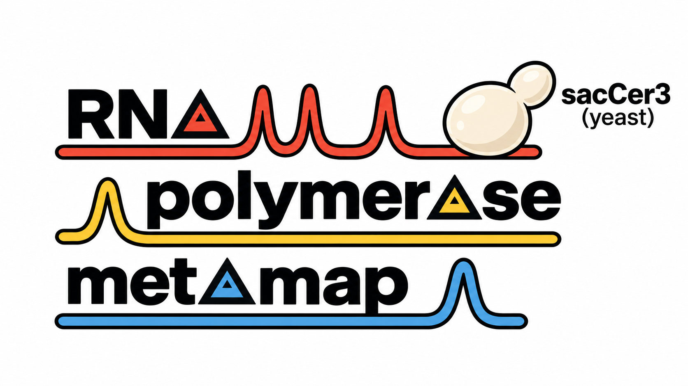

# Overview:

We applied a uniform, context-agnostic framework for scoring RNA polymerase (Pol) I, II, and III occupancies using ChIP-seq experiments performed in yeast (S. cerevisiae), facilitating unbiased annotation of polymerase occupancy and overlap. 

[](https://igv.org/app/?sessionURL=blob:xVbbbts4EP0VgS_bAi4lO87FfovdbmAgbYMYG3SxGxgkNZGIUqRCUlHdIP..Q11sJ9jWKZCgBuwRycM5M4fyke7JHVgnjSZTckBP6AkZEJebesmKUsEnVoAj0xumHAyIhRuwoAWQ6T2RKe5wTMzBHuAejUicWNJIIOZOOskgetOtv0WAr81M.r8uzxGVe1.6aRznWWpqrQxLqTNAK.EEhbSK84q7.Gz.Z5wkSTwcH8XJ.DCMVzjGIY7o6OmYjrj0G55Z.dpUlJe.63sJHplCSpyoc6PgDLQp4EpCTabeVqhdCk5YWfpWac6.gv3DRWtgzkfL0cnJPHozQoK3_.olEyJn1hRrAW5XzQb2tJbV5dE4yhq6iDkHBVdrrIIr5l.q.3StWcj3Lhk.2h2Nk3EShdVCimhPFqxJ5NjUqZLMzfgrHs6WhnIeaNfecKbTFyXlXP7fSdBANkOyjjqUYhyezWebgiXTf8LUol1ZbGJ_cdXGPiz6uL3okV_a2IdFH7cXm6su25dNXJDrrrKl_A7utU.CusBC_bfwbwlpggo9nczuqLFZ3N7ArqXpTCMM.m0vUV2f7vphQJQRFRZCmFKY3hqJRaEq3jLxNRR4T_y6DH7m4LZqHG9ATHuE7yZJcjycTEaH4.NxMpkMHwb3pLJqR8RM.kAmTBFfMT0z1is4Zzy._HRaGrUuwDIHqwI8K1i5ajwgtqyO0V9RAmCpiwsmdXxh1Kj5QWwqmV4JU2nvVtrYgimUFW.zeuu9z0DeSAXPR3cdH.C.sBIMhcusllmw2VafMHhVAQ6an2cLsA_5WIB96E6A8W8TYJGdhe_z2t8P3Ol.P7hr_vCXm8dGaCtA5cAKoz1o_4taPNHhY6W8nCt8wF0ER_Vg_w44yiHd9v9z0E7vPwd2fR_t9t0sdE0zrY1nzYMcnQlkliPkOAk6NO9EoXa4PW2cpSO8bKaidu6xWD.ytMyoFPQF8_nGD1PmGUetYi24xJRLuA2GRrPvmFXqFL5hmf272qZ2LAfdNRhYKl2p2PqjSUNN88_n56cXyw_vG38tdmuq65oGDqpVQbXMaWbu4ratLqwcKBA.3so1TMJnr0jXD_8B)  
*Middle-click or Cmd/Ctrl + click badge to open in a new tab*

The composite tracks are truncated at 3 normalized counts to accommodate GitHub's maximum file-size limit. Score tracks are truncated at 0.25.

